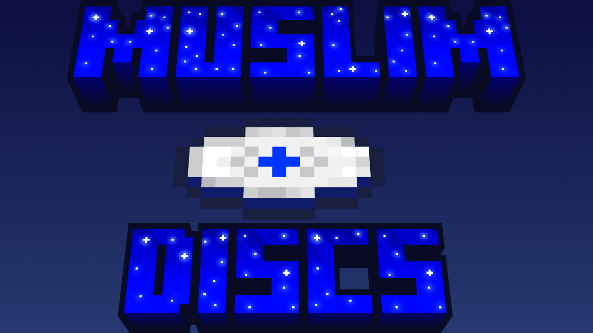

# Muslimdiscs

Use the Jukebox for more Islamic audios!

As of now, it only adds a disc that plays the Eid Takbir, but I will add more inshaAllah

## I got a question/suggestion/problem
Make an [issue](https://github.com/friedegg796/Muslimdiscs/issues), I'll check it inshaAllah.

### Could I put your Mod into MY modpack/Use it in my video?
Read the [License](https://github.com/friedegg796/Muslimdiscs?tab=License-1-ov-file)

## Credits

Eid Takbir:

YouTube CC-BY
4.0  [ Creative Commons Attribution 4.0 International ](https://creativecommons.org/licenses/by/4.0/deed.en)

https://www.youtube.com/watch?v=UBW9oWc1FNU

Video was made into an OGG audio file, and was shortened to about 17 Minutes and 7 seconds.

Careful with the above video's channel, this specific video was fine but I fear there may be not-so-good content on
there.

#### Disclaimer

NOT AN OFFICIAL MINECRAFT PRODUCT. NOT APPROVED BY OR ASSOCIATED WITH MOJANG OR MICROSOFT.